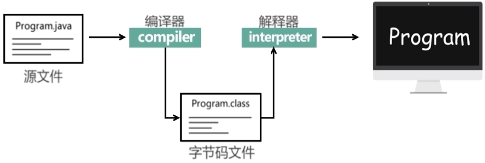
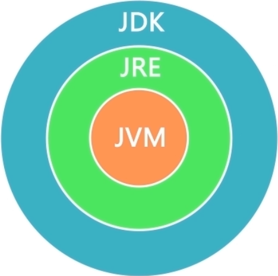
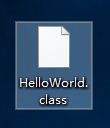
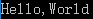
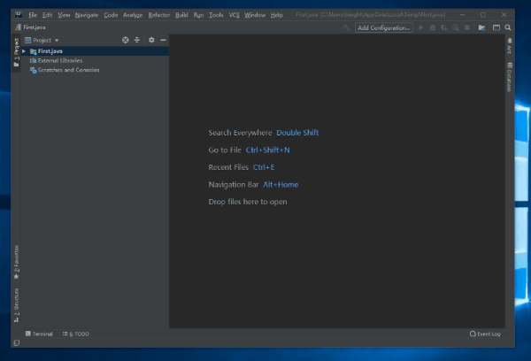

## Java简介

## 1.Java简介

Java是1995年由sun公司发布的一门面向对象的程序设计语言。在2010年的时候sun公司被Oracle公司收购。

### 1.命名故事

Java这个名字的由来，是Java创始人员团队中其中一名成员由于灵感想到的，想起自己在Java岛（爪哇岛）上曾喝过一种美味的咖啡，于是这种计算机编程语言就命名为Java，与此同时它的标起来是我们最熟悉不过的一杯热咖啡。

### 2.JVM

JVM(Java Virtual Machine),Java虚拟机

JVM是Java平台无关性的实现关键

### 3.编程语言执行流程

编译型语言：源代码 -> 编译成机器指令可执行文件 -> 执行编译完成后机器指令

编译型语言由于各个平台的机器指令不同，所以不同平台需要使用不同的编译器进行编译

解释型语言：源代码 -> 运行是直接由解释器读取源代码执行机器指令

解释型语言由于需要一行一行的解释执行代码效率低下

Java：源代码 -> 编译成字节码文件 ->执行时由Java虚拟机执行

不同平台有不同的Java虚拟机，所以可完成一直编译四处执行



### 4.JDK

JDK(Java Development Kit)，Java语言的软件开发工具包

主要组件

javac 编译器，将源程序转换为字节码文件

java 运行编译后的java程序(.class文件)

### 5.JRE

JRE(Java Runtime Environment) Java运行环境

包含Java虚拟机(JVM)、Java核心类库和支持文件

如果只需要运行Java程序，只需要安装JRE即可



JRE = JVM +JavaSE标准类库

JDK=JRE+开发者工具集(如Java编译工具)

### 6.Java平台


## 2.开发第一个Java程序

注：Java环境默认已安装配置完成

为了更详细的体验Java的编译流程，我们第一个程序使用记事本工具开发

### 1.HelloWorld.java

```Java
class HelloWorld{
 public static void main(String[] args){
	System.out.println("Hello,World");
	}
}
```

### 2.编译运行

编译

打开cmd窗口(Javac+源文件名.java)生成HelloWorld.class文件

```bash
javac HelloWorld.java
```



运行

在cmd装口中(Java +class文件名) 注意不加后缀

```bash
java HelloWorld
```



## 3.Java的程序结构

我们分析我们写的第一个Java程序

HelloWorld.java

```java
class HelloWorld{
 public static void main(String[] args){
	System.out.println("Hello,World");
	}
}
```

我们从内而外进行分析

### 1.类(class)

```java
class HelloWorld{
 ...
}
```

类名需要与文件名相同

#### 类的命名规则

- 满足Pascal命名法规范(组成类名的单词首字母大写)

class是类的关键字，而HelloWorld是类的名字

### 2.主方法

方法嵌套到类的里面

```Java
public static void main(String[] args){
	...
}
```

主方法是固定的格式，是不可修改的，主方法是程序的入口，所有的程序从主方法开始执行。

### 3.语句

```java
System.out.println("Hello,World");
```

这段语句的含义就是系统输出打印Hello,World这个字符并换行。

## 4.使用开发工具IDEA进行开发

在很多教程中十分推崇eclipse，eclipse是一种开发编辑工具，它可以提供例如包管理，代码颜色，代码提示等诸多功能，但我个人喜好是使用IDEA，当然编辑器用什么都可以。

由于编辑器的安装是非常简单的，所以偷懒节省篇幅，如果你也安装IDEA，推荐安装专业版本。

### 1.创建项目


### 2.修改TAB键为四空格

不同的编辑器会将Tab解释为不同的宽度，有些是2空格，有些是4空格还有的是8空格，不同的编辑器不同编译平台在进行代码协作的时候就会出现缩进不统一，所以我们统一修改为四个空格

### 

### 3.IDEA编译运行第一个Java程序

包通常采用域名倒叙的方式进行，kinght.me

