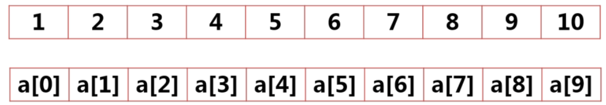

# Java数组

参考资料：

> [慕课网2019Java就业班-Java 零基础入门](https://class.imooc.com/sc/64)
>
> 书籍：Java核心卷1(原书第10版)

数组，顾名思义数据类型的组，它本身也属于一种引用数据类型，用于存储同一类型的值，然后通过整型下标，对某一具体值进行访问。

## 一维数组

> 案例引用：作为一名数学老师，要对班上五十名学生数学成绩进行输入

按照我们之前学习过的方法，我们需要定义五十个学生分别定义一个变量来进行值存储

### 声明数组

```java
数据类型[] 数组名;		//java特有格式
数据类型 数组名[];		//C\C++等共有形式
```

demo

```java
int[] a;
double b[];
char[] c;
String[] strArray;
```

声明了数组，但其实数组还不能直接使用，我们都知道声明是为了在内存中开辟一个空间出来，我们现在只告诉了计算机我们要声明一个数组，但是并没有告诉它需要多大空间。

### 创建数组

```java
/*先创建后声明*/
数组名 = new 数据类型[数组长度];
int[] arr;
arr = new int[10];	//创建一个长度为10的整型数组arr

/*创建的同时声明数组*/
数据类型[] 数组名 = new 数据类型[数组长度]
int[] arr = new int[10];	//创建一个长度为10的整型数组arr
```

完成创建之后，数组就会分配一段足够的连续的内存空间，创建之后就不能改变数组的大小了

### 数组默认值

 我们在创建完变量和常量之后，是需要给它们赋值之后才能使用的，而数组则是有默认值的，因为数组本身其实是对象

- 数字数组所有元素默认值为0
- boolean数组所有元素默认值为false
- 对象数组所有元素默认值为null

### 数组初始化

数组初始化的含义是在声明数组的同时给变量赋值，他是直接把数组声明创建赋值的流程给一次性完成

```java
数据类型[] 数组名 = {元素1,元素2,元素3,元素4,...,};
int[] arr = {1,2,3,4,5,6,7,8,9};
```

通过数组初始化创建的数组，数组的长度就是初始化时元素的个数，例如上述代码的创建空间大小如下

```java
int[] arr = new[9];
```

### 数组元素的引用

```java
数组名[下标];
```

注意：下标序号是从0开始



### 数组长度.length

length属性表示数组的长度

```java
arr.length;
```

### 案例代码

```java
import java.util.Scanner;

public class FirstDemo{
	public static void main(String[] args){
		int[] student = new int[5];//为了演示方便，50个省略为5个
		Scanner sc = new Scanner(System.in);
		for(int i=0;i<student.length;i++){
			System.out.println("请输入学生成绩");
			//输入学生成绩
			student[i] = sc.nextInt();
		}
		for(int b:student){
			System.out.println(b);
			//打印所有学生成绩  //增强for循环
		}
		/*获取几号学生成绩*/
		System.out.print("获取几号学生成绩:");
		int no = sc.nextInt();
		System.out.println(no+"号学生成绩为"+student[no-1]);
	}
}
```

> 知识回顾：
>
> [增强for循环](/programming/Java/Basics/JavaBasics/ProcessControl?id=java-增强-for-循环)
>
> [Java  Scanner 类](/programming/Java/Other/class/JavaScanner?id=java-scanner-类)

## 二维数组

二维数组也是存放相同数据类型的数据，可以看成是由多个一维数组嵌套组成。

> 案例引用：作为一名班主任老师，要对班上五十名学生语文、数学、外语成绩进行输入

### 声明数组

```java
数据类型[][] 数组名；
数据类型 数组名[][];
数据类型[] 数组名[];
```

demo

```java
//声明int类型的二维数组
int[][] intArray;
//声明float类型的二维数组
float floatArray[][];
//声明double类型的二维数组
double[] doubleArray[];
```

### 创建二维数组

```java
/*创建一个三行三列的int类型的数组*/
/*声明int类型的二维数组（先声明，后创建）*/
int[][] intArray;
intArray=new int[3][3];
/*声明的数组的同时进行创建*/
int[][] intArray=intArray=new int[3][3];
/*创建数组的时候，可以只指定行数
列数并没有指定，每行相当于一个一维数组，需要分别创建,每一行的数据数量是可以不相同的
*/
float[][] floatArray=newfloat[3][];
floatArray[0]=newfloat[3];//第一行有三列
floatArray[1]=newfloat[4];//第二行有四列
floatArray[2]=newfloat[5];//第三行有5列
```

### 数组元素的引用

与一维数组相似，行列的index值均从0开始

如：已知一个三行三列的整型二维数组intArray，它的第三行第二列元素表示为

```java
intArray[2][1];
```

### 二维数组的初始化

与一维数组类似，创建的同时为数组元素赋值，即为数组的初始化

```java
int[][] num={{1,2,3},{4,5,6},{7,8,9}};
```

创建了一个三行三列二维数组。num[1][2]的值为6

### 数组的遍历

多维数组，通常使用for循环嵌套的方式逐层打印

```java
public class FirstDemo{
	public static void main(String[] args){
		//初始化一个二维数组
		int[][] num1={{78,98},{65,75,63},{98}};
		//循环输出二维数组的内容
		for(int i=0;i<num1.length;i++){
			for(int j=0;j<num1[i].length;j++){
				System.out.print(num1[i][j]+"          ");
			}
			System.out.println();
		}
	}
}
```

