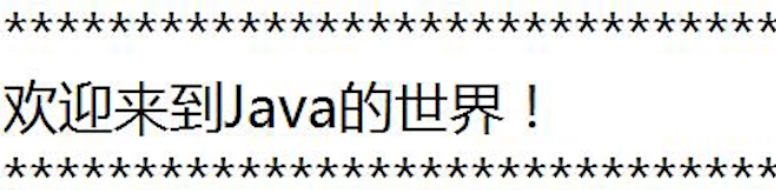

# Java方法

参考资料：

> [慕课网2019Java就业班-Java 零基础入门](https://class.imooc.com/sc/64)

这是我们Java基础章节的最后一章，从下一节开始，我们将会了解到面向对象编程的核心——面向对象。但是再讲之前，在基础结构中有个东西一直没有讲到，那就是方法

## 什么是方法?

其实基本的方法我们大家都已经接触过，那就是主方法main

```java
public static void main(String[] args){
		System.out.println("HelloWorld");
	}
```

我们都知道他是一个程序的入口，除此之外，我们还接触了

```java
Scanner sc = new Scanner(System.in);
sc.nextInt();
sc.next();

System.out.println();
```

这些都是方法，我们可以看到他们都有属于自己的功能。

总结：所谓方法，就是用来解决一类问题的代码有序组合，或者说是一个功能模块，来保证[单一功能原则](https://baike.baidu.com/item/%E5%8D%95%E4%B8%80%E5%8A%9F%E8%83%BD%E5%8E%9F%E5%88%99/22718063)

## 方法声明

语法格式：

```java
访问修饰符 返回类型 方法名(参数列表){
	方法体;
}
public static void main(String[] args){
	System.out.println("HelloWorld");
}
```

public和static属于访问修饰符，他表示这个方法是一个公开的静态的方法，关于访问修饰符，在下一章面向对象中会详细讲解。

void属于返回类型，void的意思是我不返回任何值，返回类型可以是任何的数据类型，如果有返回值需要在方法体内使用return进行返回某一个量，这个量的类型必须和返回类型相同

然后main就是方法名，方法名遵循变量的命名规则，括号内是参数列表，大括号就是具体代码构成的方法体了。

## 方法分类

### 无参无返回值方法



### 无参带返回值方法

### 带参无返回值方法

```java
public class ArgsDemo {
	//求和
	public void sum(int... n){
		int sum=0;
		for(int i:n){
			sum=sum+i;
		}
		System.out.println("sum="+sum);
	}
	public static void main(String[] args) {
		ArgsDemo ad=new ArgsDemo();
		ad.sum(1);
		ad.sum(1,2);
		ad.sum(1,2,3);
	}
}
```


### 带参带返回值方法