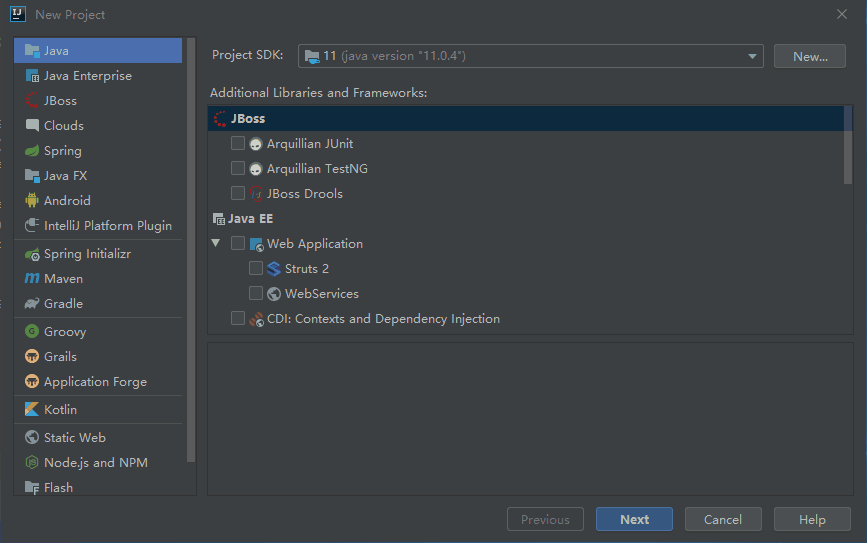
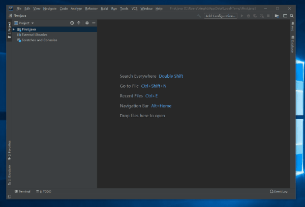

# Java初识

参考资料：

> [慕课网2019Java就业班-Java 零基础入门](https://class.imooc.com/sc/64)
>
> [JavaGuide](https://snailclimb.gitee.io/javaguide/#/)
>
> [菜鸟教程](https://www.runoob.com/java/java-basic-datatypes.html)
>
> 书籍：Java核心卷1(原书第10版)

## Java简介

从1996年Java发布以来就受到了世界的广泛关注，一度占据了世界编程语言排行榜的前三。相比于同属面向对象语言的C++，他抛弃了头文件、指针运算、结构、联合、操作符重载、虚基类等概念，巧妙的使用了Java虚拟机(JVM)完成了跨平台的应用，加上它丰富的例程库、完善的编译器、以及不遗余力维护的安全性，这些逐渐都使它成为了一个历史性的编程语言。

> Java历史： [JavaHistory.md](Supplement\JavaHistory.md) 

### Java优势总结

1. 简单易学；

2. 面向对象（封装，继承，多态）；

3. 平台无关性（ Java 虚拟机实现平台无关性）；

4. 可靠性；

5. 安全性；

6. 支持多线程（ C++ 语言没有内置的多线程机制，因此必须调用操作系统的多线程功能来进行多线程程序设计，而 Java 语言却提供了多线程支持）；

7. 支持网络编程并且很方便（ Java 语言诞生本身就是为简化网络编程设计的，因此 Java 语言不仅支持网络编程而且很方便）；

8. 编译与解释并存；

   > 修正（参见： [issue#544](https://github.com/Snailclimb/JavaGuide/issues/544)）：C++11开始（2011年的时候）,C++就引入了多线程库，在windows、linux、macos都可以使用`std::thread`和`std::async`来创建线程。参考链接：http://www.cplusplus.com/reference/thread/thread/?kw=thread

### Java虚拟机

Java虚拟机是支撑Java程序运行的核心，他是运行 Java 字节码的平台，争对于不同的平台，所使用的机器码是不同的，这是导致软件不能跨平台的核心，而Java虚拟机和字节码的出现解决了这个问题。

#### 什么是字节码?

在 Java 中，JVM可以理解的代码就叫做`字节码`（即扩展名为 `.class`  的文件），它不面向任何特定的处理器，只面向虚拟机。Java  语言通过字节码的方式，在一定程度上解决了传统解释型语言执行效率低的问题，同时又保留了解释型语言可移植的特点。所以 Java  程序运行时比较高效，而且，由于字节码并不针对一种特定的机器，因此，Java程序无须重新编译便可在多种不同操作系统的计算机上运行。

#### Java程序编译运行流程


我们需要格外注意的是 .class->机器码 这一步。在这一步 JVM  类加载器首先加载字节码文件，然后通过解释器逐行解释执行，这种方式的执行速度会相对比较慢。而且，有些方法和代码块是经常需要被调用的(也就是所谓的热点代码)，所以后面引进了 JIT 编译器，而JIT 属于运行时编译。当 JIT  编译器完成第一次编译后，其会将字节码对应的机器码保存下来，下次可以直接使用。而我们知道，机器码的运行效率肯定是高于 Java  解释器的。这也解释了我们为什么经常会说 Java 是编译与解释共存的语言。

> HotSpot采用了惰性评估(Lazy  Evaluation)的做法，根据二八定律，消耗大部分系统资源的只有那一小部分的代码（热点代码），而这也就是JIT所需要编译的部分。JVM会根据代码每次被执行的情况收集信息并相应地做出一些优化，因此执行的次数越多，它的速度就越快。JDK 9引入了一种新的编译模式AOT(Ahead of Time  Compilation)，它是直接将字节码编译成机器码，这样就避免了JIT预热等各方面的开销。JDK支持分层编译和AOT协作使用。但是 ，AOT 编译器的编译质量是肯定比不上 JIT 编译器的。

总结来说，Java虚拟机是用于运行Java字节码文件的，不同平台的JVM所对应的机器码是不相同的，程序员只需要将源代码编译成.class字节码文件后，就可以在不同平台使用相对于的虚拟机做到一次编译四处运行了。

### Java组件包

Java的安装包根据用途的不同分为JDK和JRE


#### JRE

Java Runtime Environment Java运行环境

它是运行已编译 Java 程序所需的所有内容的集合，包括 Java虚拟机（JVM），Java类库，java命令和其他的一些基础构件。但是，它不能用于创建新程序。

#### JDK

Java Development Kit Java开发环境

它是功能齐全的Java SDK。它拥有JRE所拥有的一切，还有编译器（javac）和工具（如javadoc和jdb）。它能够创建和编译程序。

如图所示，JDK包含了JRE，如果只是为了运行一下 Java 程序的话，那么只需要安装 JRE 就可以了，如果需要进行开发就需要安装JDK了。但是，这不是绝对的。有时，即使您不打算在计算机上进行任何Java开发，仍然需要安装JDK。例如，如果要使用JSP部署Web应用程序，那么从技术上讲，您只是在应用程序服务器中运行Java程序。那你为什么需要JDK呢？因为应用程序服务器会将 JSP 转换为 Java servlet，并且需要使用 JDK 来编译 servlet。

## Java开发环境安装(视频补充预留)

由于开发环境安装确实很简单，所以这里不作详细讲述，篇幅留下来作以后视频讲解空间预留。

### JDK安装

由于JDK教程安装实在太多，本文不于详细阐述 ，提供[慕课网文档](https://github.com/kinghtxg/bookblog/blob/master/programming/Java/Basics/JavaseBasics.assets/Java%E5%BC%80%E5%8F%91%E7%8E%AF%E5%A2%83%E6%90%AD%E5%BB%BAJDK%E7%9A%84%E4%B8%8B%E8%BD%BD%E5%92%8C%E5%AE%89%E8%A3%85.pdf)进行参考。

### 编辑器安装

常用的编译器有[Eclipse](https://www.eclipse.org/downloads/)和[Idea](https://www.jetbrains.com/idea/)

具体的安装步骤由于全是傻瓜式，下一步选路径在下一步

### IDEA的一些设置

> 小贴士：通常我们在创建包的时候，习惯使用域名倒叙的方式命名

#### IDEA创建项目



#### IDEA修改tab键



#### IDEA编译程序


## 第一个Java程序

### 第一个Java程序

为了更直观的了解Java程序的编译流程，我们首先使用记事本来敲第一个程序，创建记事本，将如下代码敲入其中。

```Java
public class FirstSample
{
    public static void main(String[] args)
    {
        System.out.println("Helloworld");
    }
}
```

将其保存文件名为

> FirstSample.java

打开命令行窗口，跳转到当前目录

```cmd
javac FirstSample.java
```

我们可以发现在目录下出现了一个新的文件


这个就是之前提到的字节码

然后我们使用java虚拟机来运行它

```cmd
java FirstSample
```

> 注意：这里并不加.class后缀

我们就能够看到输出的结果


### Java的程序结构基础

从上文程序由内而外可以分为三个板块

#### 1.类(class)

```Java
public class FirstSample{
 ...
}
```

在Java中类是一个加载程序逻辑的容器，程序逻辑定义了程序的行为，Java程序中的全部内容都会包含在类里。

关键字public被称为访问修饰符，访问修饰符控制了程序其他部分对这段代码的访问级别，在后续，我们将会对访问修饰符单独拿出来进行讲解。

关键字class后面紧跟的是类名，Java规定类名必须和文件名相同。

#####  Java对类名的命名规定

- 名字必须以字母开头
- 后面是字母和数字的组合字符
- 长度没有限制
- 但不能使用Java保留字

但是为了能够在程序里更加容易让程序员识别类名，所以通常情况下对类名有了补充要求(编译器不会报错)

##### 大驼峰命名法

- 类名是以大写字母开头的名词
- 如果名字有多个单词，每个单词开头都应大写
- 命名最好能反映出其作用

```java
Public class HelloWorld{...}
```

#### 2.主方法(main)

```Java
public static void main(String[] args){
	...
}
```

主方法是嵌套在类里的，主方法的作用是运行已编译程序的时候，作为程序的开始运行的入口，所以，为了代码能够指向，程序必须有一个主方法。

主方法的格式以及命名都是固定的，不能进行修改。

> 根据[Java语言规范](http://docs.oracle.com/javase/specs),main方法必须声明为public，但是不是public时，JavaSE1.4以前有些解释器同样能够正确执行Java程序。

#### 3.程序语句

```Java
System.out.println("Helloworld");
```

程序语句的不同组合，组成了数不清的程序，他代表了程序的具体功能和逻辑，在这一距离，表示着，系统输出打印Helloworld并换行，在Java中，程序语句必须用分号结束。

## 注释

在程序员阅读代码的时候，为了方便理解，通常需要对代码功能结构、关键函数等信息进行文字备注，而这一部分的代码不会也不能出现在可执行程序中，而程序也不必担心这一部分代码在编译完成后导致可执行膨胀，这部分内容叫做注释

Java的注释有三种

```java
//双斜杠注释，从注释处到行结尾
```

```Java
/*多行注释
被包裹内容全部注释*/
```

```Java
/**
文档注释,多行注释的基础上，会自动生成备注文档，后续会进行讲解
*/
```

注意：注释内容是不允许嵌套的。