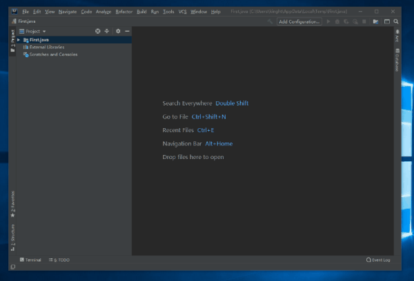

# Java基础

参考资料：

> [慕课网2019Java就业班-Java 零基础入门](https://class.imooc.com/sc/64)
>
> [JavaGuide](https://snailclimb.gitee.io/javaguide/#/)
>
> [菜鸟教程](https://www.runoob.com/java/java-basic-datatypes.html)
>
> 书籍：Java核心卷1(原书第10版)

## Java简介

从1996年Java发布以来就受到了世界的广泛关注，一度占据了世界编程语言排行榜的前三。相比于同属面向对象语言的C++，他抛弃了头文件、指针运算、结构、联合、操作符重载、虚基类等概念，巧妙的使用了Java虚拟机(JVM)完成了跨平台的应用，加上它丰富的例程库、完善的编译器、以及不遗余力维护的安全性，都使它成为了一个历史性的编程语言。

### Java优势总结

1. 简单易学；

2. 面向对象（封装，继承，多态）；

3. 平台无关性（ Java 虚拟机实现平台无关性）；

4. 可靠性；

5. 安全性；

6. 支持多线程（ C++ 语言没有内置的多线程机制，因此必须调用操作系统的多线程功能来进行多线程程序设计，而 Java 语言却提供了多线程支持）；

7. 支持网络编程并且很方便（ Java 语言诞生本身就是为简化网络编程设计的，因此 Java 语言不仅支持网络编程而且很方便）；

8. 编译与解释并存；

   > 修正（参见： [issue#544](https://github.com/Snailclimb/JavaGuide/issues/544)）：C++11开始（2011年的时候）,C++就引入了多线程库，在windows、linux、macos都可以使用`std::thread`和`std::async`来创建线程。参考链接：http://www.cplusplus.com/reference/thread/thread/?kw=thread

### Java虚拟机

Java虚拟机是支撑Java程序运行的核心，他是运行 Java 字节码的平台，争对于不同的平台，所使用的机器码是不同的，这是导致软件不能跨平台的核心，而Java虚拟机和字节码的出现解决了这个问题。

#### 什么是字节码?

在 Java 中，JVM可以理解的代码就叫做`字节码`（即扩展名为 `.class`  的文件），它不面向任何特定的处理器，只面向虚拟机。Java  语言通过字节码的方式，在一定程度上解决了传统解释型语言执行效率低的问题，同时又保留了解释型语言可移植的特点。所以 Java  程序运行时比较高效，而且，由于字节码并不针对一种特定的机器，因此，Java程序无须重新编译便可在多种不同操作系统的计算机上运行。

#### Java程序编译运行流程


我们需要格外注意的是 .class->机器码 这一步。在这一步 JVM  类加载器首先加载字节码文件，然后通过解释器逐行解释执行，这种方式的执行速度会相对比较慢。而且，有些方法和代码块是经常需要被调用的(也就是所谓的热点代码)，所以后面引进了 JIT 编译器，而JIT 属于运行时编译。当 JIT  编译器完成第一次编译后，其会将字节码对应的机器码保存下来，下次可以直接使用。而我们知道，机器码的运行效率肯定是高于 Java  解释器的。这也解释了我们为什么经常会说 Java 是编译与解释共存的语言。

> HotSpot采用了惰性评估(Lazy  Evaluation)的做法，根据二八定律，消耗大部分系统资源的只有那一小部分的代码（热点代码），而这也就是JIT所需要编译的部分。JVM会根据代码每次被执行的情况收集信息并相应地做出一些优化，因此执行的次数越多，它的速度就越快。JDK 9引入了一种新的编译模式AOT(Ahead of Time  Compilation)，它是直接将字节码编译成机器码，这样就避免了JIT预热等各方面的开销。JDK支持分层编译和AOT协作使用。但是 ，AOT 编译器的编译质量是肯定比不上 JIT 编译器的。

总结来说，Java虚拟机是用于运行Java字节码文件的，不同平台的JVM所对应的机器码是不相同的，程序员只需要将源代码编译成.class字节码文件后，就可以在不同平台使用相对于的虚拟机做到一次编译四处运行了。

### Java组件包

Java的安装包根据用途的不同分为JDK和JRE


#### JRE

Java Runtime Environment Java运行环境

它是运行已编译 Java 程序所需的所有内容的集合，包括 Java虚拟机（JVM），Java类库，java命令和其他的一些基础构件。但是，它不能用于创建新程序。

#### JDK

Java Development Kit Java开发环境

它是功能齐全的Java SDK。它拥有JRE所拥有的一切，还有编译器（javac）和工具（如javadoc和jdb）。它能够创建和编译程序。

如图所示，JDK包含了JRE，如果只是为了运行一下 Java 程序的话，那么只需要安装 JRE 就可以了，如果需要进行开发就需要安装JDK了。但是，这不是绝对的。有时，即使您不打算在计算机上进行任何Java开发，仍然需要安装JDK。例如，如果要使用JSP部署Web应用程序，那么从技术上讲，您只是在应用程序服务器中运行Java程序。那你为什么需要JDK呢？因为应用程序服务器会将 JSP 转换为 Java servlet，并且需要使用 JDK 来编译 servlet。

## Java开发环境安装(视频补充预留)

由于开发环境安装确实很简单，所以这里不作详细讲述，篇幅留下来作以后视频讲解空间预留。

### JDK安装

由于JDK教程安装实在太多，本文不于详细阐述 ，提供[慕课网文档](https://github.com/kinghtxg/bookblog/blob/master/programming/Java/Basics/JavaseBasics.assets/Java%E5%BC%80%E5%8F%91%E7%8E%AF%E5%A2%83%E6%90%AD%E5%BB%BAJDK%E7%9A%84%E4%B8%8B%E8%BD%BD%E5%92%8C%E5%AE%89%E8%A3%85.pdf)进行参考。

### 编辑器安装

常用的编译器有[Eclipse](https://www.eclipse.org/downloads/)和[Idea](https://www.jetbrains.com/idea/)

具体的安装步骤由于全是傻瓜式，下一步选路径在下一步

### IDEA的一些设置

> 小贴士：通常我们在创建包的时候，习惯使用域名倒叙的方式命名

#### IDEA创建项目


#### IDEA修改tab键



#### IDEA编译程序


## 第一个Java程序

### 第一个Java程序

为了更直观的了解Java程序的编译流程，我们首先使用记事本来敲第一个程序，创建记事本，将如下代码敲入其中。

```Java
public class FirstSample
{
    public static void main(String[] args)
    {
        System.out.println("Helloworld");
    }
}
```

将其保存文件名为

> FirstSample.java

打开命令行窗口，跳转到当前目录

```cmd
javac FirstSample.java
```

我们可以发现在目录下出现了一个新的文件


这个就是之前提到的字节码

然后我们使用java虚拟机来运行它

```cmd
java FirstSample
```

> 注意：这里并不加.class后缀

我们就能够看到输出的结果


### Java的程序结构基础

从上文程序由内而外可以分为三个板块

#### 1.类(class)

```Java
public class FirstSample{
 ...
}
```

在Java中类是一个加载程序逻辑的容器，程序逻辑定义了程序的行为，Java程序中的全部内容都会包含在类里。

关键字public被称为访问修饰符，访问修饰符控制了程序其他部分对这段代码的访问级别，在后续，我们将会对访问修饰符单独拿出来进行讲解。

关键字class后面紧跟的是类名，Java规定类名必须和文件名相同。

#####  Java对类名的命名规定

- 名字必须以字母开头
- 后面是字母和数字的组合字符
- 长度没有限制
- 但不能使用Java保留字

但是为了能够在程序里更加容易让程序员识别类名，所以通常情况下对类名有了补充要求(编译器不会报错)

##### 大驼峰命名法

- 类名是以大写字母开头的名词
- 如果名字有多个字母，每个字母开头都应大写
- 命名最好能反映出其作用

#### 2.主方法(main)

```Java
public static void main(String[] args){
	...
}
```

主方法是嵌套在类里的，主方法的作用是运行已编译程序的时候，作为程序的开始运行的入口，所以，为了代码能够指向，程序必须有一个主方法。

主方法的格式以及命名都是固定的，不能进行修改。

> 根据[Java语言规范](http://docs.oracle.com/javase/specs),main方法必须声明为public，但是不是public时，JavaSE1.4以前有些解释器同样能够正确执行Java程序。

#### 3.程序语句

```Java
System.out.println("Helloworld");
```

程序语句的不同组合，组成了数不清的程序，他代表了程序的具体功能和逻辑，在这一距离，表示着，系统输出打印Helloworld并换行，在Java中，程序语句必须用分号结束。

## 注释

在程序员阅读代码的时候，为了方便理解，通常需要对代码功能结构、关键函数等信息进行文字备注，而这一部分的代码不会也不能出现在可执行程序中，而程序也不必担心这一部分代码在编译完成后导致可执行膨胀，这部分内容叫做注释

Java的注释有三种

```java
//双斜杠注释，从注释处到行结尾
```

```Java
/*多行注释
被包裹内容全部注释*/
```

```Java
/**
文档注释,多行注释的基础上，会自动生成备注文档，后续会进行讲解
*/
```

值得注意的是：注释内容是不允许嵌套的。

## 数据类型

Java是一种强类型的语言，每一个量的使用之前，都需要声明类型以便分配对应大小的内存空间用于存放这个量的值，而数据类型的不同决定着这个空间大小的不同。

Java中有4种整型、2种浮点类型、1种用于表达Unicode编码的字符类型char以及1种用于表示真假值的boolean类型。

### 基本数据类型

#### 整型

整型用于表示没有小数部分的数值，它可以为负数，Java种提供了四种整形。

| Java整型 |          |                                                      |        |
| -------- | :------: | :--------------------------------------------------- | ------ |
| 类型     | 存储需求 | 取值范围                                             | 默认值 |
| byte     |  1字节   | -128~127                                             | 0      |
| short    |  2字节   | -32768~32767                                         | 0      |
| int      |  4字节   | -2,147,483,648~2,147,483,647                         | 0      |
| long     |  8字节   | -9,223,372,036,854,775,808~9,223,372,036,854,775,807 | 0L     |

通常，int是最常用的整型类型，long用于特大数字例如地球上居住人数，byte和short通常用于需要严格控制储存空间大小的情况。

> Java程序由于必须要保证在所有机器上都能得到相同的运行结果，所以在Java中，各种数据类型的范围与运行程序的机器无关，这一点与C\C++有区别
>
> 注意：Java没有任何无符号形势的整型类型

##### 字面值

在计算机的世界里，除了最常用的十进制以外，还有二进制八进制十六进制也比较常见，而我们在赋值的时候需要对不同的进制数进行区分

| 字面值   |            |          |
| -------- | ---------- | -------- |
| 进制     | 字面值符号 | 例子     |
| 十进制   |            | 12,13,48 |
| 二进制   | 0b         | 0b1001   |
| 八进制   | 0          | 037      |
| 十六进制 | 0x         | 0XABCD   |

#### 浮点类型

浮点类型用于表示有小数部分的数值

| Java浮点数 |          |                   |        |
| ---------- | -------- | ----------------- | ------ |
| 类型       | 存储需求 | 取值范围          | 默认值 |
| float      | 4字节    | 大约小数点后6-7位 | 0.0f   |
| double     | 8字节    | 大约小数点后15位  | 0.0d   |

double表示这种类型的数值精度是float的两倍，所以也有人叫他为双精度类型，在使用赋值的时候，float值需要在后面加一个f或者F,例如：3.14f，如果不加，则会被计算机默认为double类型

> 所有浮点数值的计算都遵循[IEEE754](https://baike.baidu.com/item/IEEE%20754/3869922?fromtitle=IEEE754%E6%A0%87%E5%87%86&fromid=10427270&fr=aladdin)规范
>
> 简单来说，表示溢出、出错的情况有三个特殊的浮点值：
>
> - 正无穷
>
> - 负无穷
>
> - NaN
>
>   例如：一个正整数除以0结果为正无穷，计算0/0或负数平方根为NaN

注意：由于浮点数精确度问题，所以它并不适合无法接受舍入误差的金融计算中，如果数值无法接受任何的舍入误差，请使用BigDecimal类

#### char类型

char类型表示单个字符

char类型的字面值要用单引号括起来

> 拓展阅读：[Unicode和char类型](./other/Java/unicode和char类型)

#### boolean类型

boolean类型只有两个值：false和true，通常用于判断逻辑条件，且，整型值和布尔值之间不能进行相互转换

> 为什么没有字符串？
>
> String 表示的是字符串对象，Java 中将字符串作为对象处理，而不是基本数据类型。在基本数据类型中，与String  比较相似的是字符类型（char），该类型变量只能表示一个字符长度，如‘a’。为char 类型赋值要使用单引号，为String  类型对象赋值要使用双引号。

### 引用数据类型

引用数据类型有三个类、接口、数组，在后续章节会单独讲述。

### 字符串

从严格意义来说，Java的字符串系统并不属于数据类型的一种，它其实是Unicode字符串序列，例如Java是由五个Unicode字符组成的，而为了方便使用在Java的标准类库中提供了一个预定义的类，叫做String，并且规定了，字符串的值由双引号括起来

```Java
String a = "Helloworld";
```

## 变量

之前我们提到过，在程序当中，每一个量都有自己的存放空间，如果这个存放空间里面的值是可以变化的，我们把这个量叫做变量

变量格式：

```Java
数据类型 变量名；
```

例子：

```java
int a;
long b;
short c;
```

我们可以看到，每个声明以分号结束，变量名满足标识符命名规则

### 标识符命名规则

- 标识符可以由字母、数字、下划线（_）和美元符($）组成，不能以数字开头
- 标识符严格区分大小写
- 标识符不能是Java关键字和保留字
- 标识符的命名最好能反映出其作用

### 初始化变量

在声明一个变量之后，我们需要使用赋值语句对变量进行初始化操作。

赋值语句的使用方法是：变量名 = 表达式(值);

```java
int a;
a = 10;//a的值为10
/*也可以在变量声明时初始化(声明变量并赋值)*/
int a = 10;
double b = 10.25;
float c = 9.9f;
```

在Java中，变量的声明尽可能的靠近变量第一次使用的地方，这是一种良好的编写习惯。

## 常量

常量差距不多，但是常量的值在经过第一次赋值之后，不允许二次赋值

常量格式:

```java
final 数据类型 变量名；
```

例子：

```java
final int A;
final long B;
final short C;
```

常量同样要求满住标识符的命名规范，但在编写程序的时候，为了和变量做区分，我们通常将常量全部大写

### 类常量

在Java中，有时需要一个常量在一个类的多个方法中反复调用，通常我们将这个常量在方法外面，使用static final设置成类常量

例如

```java
public class Constants{
    public static final double p = 3.14;
    //p值为类常量
    public static void main(String[] args){
        System.out.println(p);
    }
}
```

## 运算符

计算机的最基本用途之一就是执行数学运算，作为一门计算机语言，Java也提供了一套丰富的运算符来操纵变量。我们可以把运算符分成以下几组：

### 算数运算符

假设整数变量A的值为10，变量B的值为20：

| 操作符 | 描述                              | 例子                               |
| ------ | --------------------------------- | ---------------------------------- |
| +      | 加法 - 相加运算符两侧的值         | A + B 等于 30                      |
| -      | 减法 - 左操作数减去右操作数       | A – B 等于 -10                     |
| *      | 乘法 - 相乘操作符两侧的值         | A * B等于200                       |
| /      | 除法 - 左操作数除以右操作数       | B / A等于2                         |
| ％     | 取余 - 左操作数除以右操作数的余数 | B%A等于0                           |
| ++     | 自增: 操作数的值增加1             | B++ 或 ++B 等于 21（区别详见下文） |
| --     | 自减: 操作数的值减少1             | B-- 或 --B 等于 19（区别详见下文） |

代码demo

Test.java

```java
public class Test {
  public static void main(String[] args) {
     int a = 10;
     int b = 20;
     int c = 25;
     int d = 25;
     System.out.println("a + b = " + (a + b) );
     System.out.println("a - b = " + (a - b) );
     System.out.println("a * b = " + (a * b) );
     System.out.println("b / a = " + (b / a) );
     System.out.println("b % a = " + (b % a) );
     System.out.println("c % a = " + (c % a) );
     System.out.println("a++   = " +  (a++) );
     System.out.println("a--   = " +  (a--) );
     // 查看  d++ 与 ++d 的不同
     System.out.println("d++   = " +  (d++) );
     System.out.println("++d   = " +  (++d) );
  }
}
```

运算结果

```java
进行自增运算后的值等于4
进行自减运算后的值等于2
```

#### 自增自减运算符

自增（++）自减（--）运算符是一种特殊的算术运算符，在算术运算符中需要两个操作数来进行运算，而自增自减运算符是一个操作数。

前缀自增自减法(++a,--a):先进行自增或者自减运算，再进行表达式运算。

后缀自增自减法(a++,a--): 先进行表达式运算，再进行自增或者自减运算。

代码demo

selfAddMinus.java

```Java
public class selfAddMinus{
    public static void main(String[] args){
        int a = 5;//定义一个变量；
        int b = 5;
        int x = 2*++a;
        int y = 2*b++;
        System.out.println("自增运算符前缀运算后a="+a+",x="+x);
        System.out.println("自增运算符后缀运算后b="+b+",y="+y);
    }
}
```

运算结果

```java
自增运算符前缀运算后a=6，x=12
自增运算符后缀运算后b=6，y=10
```

### 关系运算符

下表为Java支持的关系运算符,表格中的实例整数变量A的值为10，变量B的值为20：

| 运算符 | 描述                                                         | 例子          |
| ------ | ------------------------------------------------------------ | :------------ |
| ==     | 检查如果两个操作数的值是否相等，如果相等则条件为真。         | （A==B)为假。 |
| !=     | 检查如果两个操作数的值是否相等，如果值不相等则条件为真。     | (A!=B)为真。  |
| >      | 检查左操作数的值是否大于右操作数的值，如果是那么条件为真。   | （A>B)为假。  |
| <      | 检查左操作数的值是否小于右操作数的值，如果是那么条件为真。   | （A<B)为真。  |
| >=     | 检查左操作数的值是否大于或等于右操作数的值，如果是那么条件为真。 | （A>=B)为假。 |
| <=     | 检查左操作数的值是否小于或等于右操作数的值，如果是那么条件为真。 | （A<=B)为真。 |

代码demo

Test.java

```java
public class Test {
  public static void main(String[] args) {
     int a = 10;
     int b = 20;
     System.out.println("a == b = " + (a == b) );
     System.out.println("a != b = " + (a != b) );
     System.out.println("a > b = " + (a > b) );
     System.out.println("a < b = " + (a < b) );
     System.out.println("b >= a = " + (b >= a) );
     System.out.println("b <= a = " + (b <= a) );
  }
}
```

运算结果

```java
a == b = false
a != b = true
a > b = false
a < b = true
b >= a = true
b <= a = false
```

### 位运算符

Java定义了位运算符，应用于整数类型(int)，长整型(long)，短整型(short)，字符型(char)，和字节型(byte)等类型。位运算符作用在所有的位上，并且按位运算。假设a = 60，b = 13;它们的二进制格式表示将如下：

```java
A = 0011 1100
B = 0000 1101
-----------------
A&B = 0000 1100
A | B = 0011 1101
A ^ B = 0011 0001
~A= 1100 0011
```

下表列出了位运算符的基本运算，假设整数变量 A 的值为 60 和变量 B 的值为 13：

| 操作符 | 描述                                                         | 例子                           |
| ------ | ------------------------------------------------------------ | ------------------------------ |
| ＆     | 如果相对应位都是1，则结果为1，否则为0                        | （A＆B），得到12，即0000 1100  |
| \|     | 如果相对应位都是 0，则结果为 0，否则为 1                     | （A \| B）得到61，即 0011 1101 |
| ^      | 如果相对应位值相同，则结果为0，否则为1                       | （A ^ B）得到49，即 0011 0001  |
| 〜     | 按位取反运算符翻转操作数的每一位，即0变成1，1变成0。         | （〜A）得到-61，即1100 0011    |
| <<     | 按位左移运算符。左操作数按位左移右操作数指定的位数。         | A << 2得到240，即 1111 0000    |
| >>     | 按位右移运算符。左操作数按位右移右操作数指定的位数。         | A >> 2得到15即 1111            |
| >>>    | 按位右移补零操作符。左操作数的值按右操作数指定的位数右移，移动得到的空位以零填充。 | A>>>2得到15即0000 1111         |

代码demo

Test.java

```Java
public class Test {
  public static void main(String[] args) {
     int a = 60; /* 60 = 0011 1100 */ 
     int b = 13; /* 13 = 0000 1101 */
     int c = 0;
     c = a & b;       /* 12 = 0000 1100 */
     System.out.println("a & b = " + c );
     c = a | b;       /* 61 = 0011 1101 */
     System.out.println("a | b = " + c );
     c = a ^ b;       /* 49 = 0011 0001 */
     System.out.println("a ^ b = " + c );
     c = ~a;          /*-61 = 1100 0011 */
     System.out.println("~a = " + c );
     c = a << 2;     /* 240 = 1111 0000 */
     System.out.println("a << 2 = " + c );
     c = a >> 2;     /* 15 = 1111 */
     System.out.println("a >> 2  = " + c );
     c = a >>> 2;     /* 15 = 0000 1111 */
     System.out.println("a >>> 2 = " + c );
  }
} 
```

运算结果

```java
a & b = 12
a | b = 61
a ^ b = 49
~a = -61
a << 2 = 240
a >> 2  = 15
a >>> 2 = 15
```

### 逻辑运算符

下表列出了逻辑运算符的基本运算，假设布尔变量A为真，变量B为假

| 操作符 | 描述                                                         | 例子              |
| ------ | ------------------------------------------------------------ | ----------------- |
| &&     | 称为逻辑与运算符。当且仅当两个操作数都为真，条件才为真。     | (A && B)为假。    |
| \| \|  | 称为逻辑或操作符。如果任何两个操作数任何一个为真，条件为真。 | (A \| \| B)为真。 |
| ！     | 称为逻辑非运算符。用来反转操作数的逻辑状态。如果条件为true，则逻辑非运算符将得到false。 | !(A && B)为真。   |

代码demo

Test.java

```java
public class Test {
  public static void main(String[] args) {
     boolean a = true;
     boolean b = false;
     System.out.println("a && b = " + (a&&b));
     System.out.println("a || b = " + (a||b) );
     System.out.println("!(a && b) = " + !(a && b));
  }
}
```

运算结果

```java
a && b = false
a || b = true
!(a && b) = true
```

#### 短路逻辑运算符

当使用与逻辑运算符时，在两个操作数都为true时，结果才为true，但是当得到第一个操作为false时，其结果就必定是false，这时候就不会再判断第二个操作了。

代码demo

Test.java

```java
public class LuoJi{
    public static void main(String[] args){
        int a = 5;//定义一个变量；
        boolean b = (a<4)&&(a++<10);
        System.out.println("使用短路逻辑运算符的结果为"+b);
        System.out.println("a的结果为"+a);
    }
}
```

运算结果

```java
使用短路逻辑运算符的结果为false
a的结果为5
```

**解析：** 该程序使用到了短路逻辑运算符(&&)，首先判断 a<4 的结果为 false，则 b 的结果必定是 false，所以不再执行第二个操作 a++<10 的判断，所以 a 的值为 5。

### 赋值运算符

下面是Java语言支持的赋值运算符：

| 操作符 | 描述                                                        | 例子                               |
| ------ | ----------------------------------------------------------- | ---------------------------------- |
| =      | 简单的赋值运算符，将右操作数的值赋给左侧操作数              | C = A + B将把A + B得到的值赋给C    |
| + =    | 加和赋值操作符，它把左操作数和右操作数相加赋值给左操作数    | C + = A等价于C = C + A             |
| - =    | 减和赋值操作符，它把左操作数和右操作数相减赋值给左操作数    | C - = A等价于C = C - A             |
| * =    | 乘和赋值操作符，它把左操作数和右操作数相乘赋值给左操作数    | C * = A等价于C = C * A             |
| / =    | 除和赋值操作符，它把左操作数和右操作数相除赋值给左操作数    | C/= A,C与A同类型时等价于 C = C / A |
| (％)=  | 取模和赋值操作符,它把左操作数和右操作数取模后赋值给左操作数 | C％= A等价于C = C％A               |
| <<=    | 左移位赋值运算符                                            | C << = 2等价于C = C << 2           |
| >>=    | 右移位赋值运算符                                            | C >> = 2等价于C = C >> 2           |
| ＆=    | 按位与赋值运算符                                            | C＆= 2等价于C = C＆2               |
| ^=     | 按位异或赋值操作符                                          | C ^ = 2等价于C = C ^ 2             |
| \| =   | 按位或赋值操作符                                            | C \| = 2等价于C = C \| 2           |

代码demo

Test.java

```java
public class Test {
    public static void main(String[] args) {
        int a = 10;
        int b = 20;
        int c = 0;
        c = a + b;
        System.out.println("c = a + b = " + c );
        c += a ;
        System.out.println("c += a  = " + c );
        c -= a ;
        System.out.println("c -= a = " + c );
        c *= a ;
        System.out.println("c *= a = " + c );
        a = 10;
        c = 15;
        c /= a ;
        System.out.println("c /= a = " + c );
        a = 10;
        c = 15;
        c %= a ;
        System.out.println("c %= a  = " + c );
        c <<= 2 ;
        System.out.println("c <<= 2 = " + c );
        c >>= 2 ;
        System.out.println("c >>= 2 = " + c );
        c >>= 2 ;
        System.out.println("c >>= 2 = " + c );
        c &= a ;
        System.out.println("c &= a  = " + c );
        c ^= a ;
        System.out.println("c ^= a   = " + c );
        c |= a ;
        System.out.println("c |= a   = " + c );
    }
}
```

运算结果

```java
c = a + b = 30
c += a = 40
c -= a = 30
c *= a = 300
c /= a = 1
c %= a  = 5
c <<= 2 = 20
c >>= 2 = 5
c >>= 2 = 1
c &= a = 0
c ^= a = 10
c |= a = 10
```

### 条件运算符

条件运算符也被称为三元运算符。该运算符有3个操作数，并且需要判断布尔表达式的值。该运算符的主要是决定哪个值应该赋值给变量。

```java
variable x = (expression) ? value if true : value if false
```

代码demo

Test.java

```java
public class Test {
   public static void main(String[] args){
      int a , b;
      a = 10;
      // 如果 a 等于 1 成立，则设置 b 为 20，否则为 30
      b = (a == 1) ? 20 : 30;
      System.out.println( "Value of b is : " +  b );
      // 如果 a 等于 10 成立，则设置 b 为 20，否则为 30
      b = (a == 10) ? 20 : 30;
      System.out.println( "Value of b is : " + b );
   }
}
```

运算结果

```java
Value of b is : 30
Value of b is : 20
```

### instanceof 运算符

该运算符用于操作对象实例，检查该对象是否是一个特定类型（类类型或接口类型）。

instanceof运算符使用格式如下：

```java
( Object reference variable ) instanceof  (class/interface type)
```

如果运算符左侧变量所指的对象，是操作符右侧类或接口(class/interface)的一个对象，那么结果为真。

下面是一个例子：

```java
String name = "James";
boolean result = name instanceof String; // 由于 name 是 String 类型，所以返回真
```

如果被比较的对象兼容于右侧类型,该运算符仍然返回true。

看下面的例子：

```java
class Vehicle {}
public class Car extends Vehicle {
   public static void main(String[] args){
      Vehicle a = new Car();
      boolean result =  a instanceof Car;
      System.out.println( result);
   }
}
```

运算结果

```
true
```

### Java运算符优先级

当多个运算符出现在一个表达式中，谁先谁后呢？这就涉及到运算符的优先级别的问题。在一个多运算符的表达式中，运算符优先级不同会导致最后得出的结果差别甚大。

例如，（1+3）＋（3+2）*2，这个表达式如果按加号最优先计算，答案就是 18，如果按照乘号最优先，答案则是 14。

再如，x = 7 + 3 * 2;这里x得到13，而不是20，因为乘法运算符比加法运算符有较高的优先级，所以先计算3 * 2得到6，然后再加7。

下表中具有最高优先级的运算符在的表的最上面，最低优先级的在表的底部。

| 类别     | 操作符                                     | 关联性   |
| -------- | ------------------------------------------ | -------- |
| 后缀     | () [] . (点操作符)                         | 左到右   |
| 一元     | + + - ！〜                                 | 从右到左 |
| 乘性     | * /％                                      | 左到右   |
| 加性     | + -                                        | 左到右   |
| 移位     | >> >>>  <<                                 | 左到右   |
| 关系     | >> = << =                                  | 左到右   |
| 相等     | == !=                                      | 左到右   |
| 按位与   | ＆                                         | 左到右   |
| 按位异或 | ^                                          | 左到右   |
| 按位或   | \|                                         | 左到右   |
| 逻辑与   | &&                                         | 左到右   |
| 逻辑或   | \| \|                                      | 左到右   |
| 条件     | ？：                                       | 从右到左 |
| 赋值     | = + = - = * = / =％= >> = << =＆= ^ = \| = | 从右到左 |
| 逗号     | ，                                         | 左到右   |

## 数据类型转换

在程序中，我们经常需要将一种数值类型转换为另一种数值类型来进行应用

类型转换分为自动类型转换和强制类型转换

### 自动类型转换(隐式转换)

在运算中，指的是小空间数据类型转向大空间数据类型。


由于小空间的数值本身就小于大空间，小物品放在大物品里，不会发生任何的变化

```Java
int a;
short b = 10;
a = b;
```

### 强制类型转换

而强制类型转换就恰恰相反，通常用于，把大空间的值放到小空间里，那么就可能存在小空间放不下的情况，所以小空间会把放不下的那部分给丢掉

```Java
double d＝123.4;
float f=(float)d;
```

