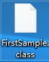

# Java基础

参考资料：

> [慕课网2019Java就业班-Java 零基础入门](https://class.imooc.com/sc/64)
>
> [JavaGuide](https://snailclimb.gitee.io/javaguide/#/)
>
> 书籍：Java核心卷1(原书第10版)

## Java简介

从1996年Java发布以来就受到了世界的广泛关注，一度占据了世界编程语言排行榜的前三。相比于同属面向对象语言的C++，他抛弃了头文件、指针运算、结构、联合、操作符重载、虚基类等概念，巧妙的使用了Java虚拟机(JVM)完成了跨平台的应用，加上它丰富的例程库、完善的编译器、以及不遗余力维护的安全性，都使它成为了一个历史性的编程语言。

### Java优势总结

1. 简单易学；
2. 面向对象（封装，继承，多态）；
3. 平台无关性（ Java 虚拟机实现平台无关性）；
4. 可靠性；
5. 安全性；
6. 支持多线程（ C++ 语言没有内置的多线程机制，因此必须调用操作系统的多线程功能来进行多线程程序设计，而 Java 语言却提供了多线程支持）；
7. 支持网络编程并且很方便（ Java 语言诞生本身就是为简化网络编程设计的，因此 Java 语言不仅支持网络编程而且很方便）；
8. 编译与解释并存；

### Java虚拟机

Java虚拟机是支撑Java程序运行的核心，他是运行 Java 字节码的平台，争对于不同的平台，所使用的机器码是不同的，这是导致软件不能跨平台的核心，而Java虚拟机和字节码的出现解决了这个问题。

#### 什么是字节码?

在 Java 中，JVM可以理解的代码就叫做`字节码`（即扩展名为 `.class`  的文件），它不面向任何特定的处理器，只面向虚拟机。Java  语言通过字节码的方式，在一定程度上解决了传统解释型语言执行效率低的问题，同时又保留了解释型语言可移植的特点。所以 Java  程序运行时比较高效，而且，由于字节码并不针对一种特定的机器，因此，Java程序无须重新编译便可在多种不同操作系统的计算机上运行。

#### Java程序编译运行流程


我们需要格外注意的是 .class->机器码 这一步。在这一步 JVM  类加载器首先加载字节码文件，然后通过解释器逐行解释执行，这种方式的执行速度会相对比较慢。而且，有些方法和代码块是经常需要被调用的(也就是所谓的热点代码)，所以后面引进了 JIT 编译器，而JIT 属于运行时编译。当 JIT  编译器完成第一次编译后，其会将字节码对应的机器码保存下来，下次可以直接使用。而我们知道，机器码的运行效率肯定是高于 Java  解释器的。这也解释了我们为什么经常会说 Java 是编译与解释共存的语言。

> HotSpot采用了惰性评估(Lazy  Evaluation)的做法，根据二八定律，消耗大部分系统资源的只有那一小部分的代码（热点代码），而这也就是JIT所需要编译的部分。JVM会根据代码每次被执行的情况收集信息并相应地做出一些优化，因此执行的次数越多，它的速度就越快。JDK 9引入了一种新的编译模式AOT(Ahead of Time  Compilation)，它是直接将字节码编译成机器码，这样就避免了JIT预热等各方面的开销。JDK支持分层编译和AOT协作使用。但是 ，AOT 编译器的编译质量是肯定比不上 JIT 编译器的。

总结来说，Java虚拟机是用于运行Java字节码文件的，不同平台的JVM所对应的机器码是不相同的，程序员只需要将源代码编译成.class字节码文件后，就可以在不同平台使用相对于的虚拟机做到一次编译四处运行了。

### Java组件包

Java的安装包根据用途的不同分为JDK和JRE


#### JRE

Java Runtime Environment Java运行环境

它是运行已编译 Java 程序所需的所有内容的集合，包括 Java虚拟机（JVM），Java类库，java命令和其他的一些基础构件。但是，它不能用于创建新程序。

#### JDK

Java Development Kit Java开发环境

它是功能齐全的Java SDK。它拥有JRE所拥有的一切，还有编译器（javac）和工具（如javadoc和jdb）。它能够创建和编译程序。

如图所示，JDK包含了JRE，如果只是为了运行一下 Java 程序的话，那么只需要安装 JRE 就可以了，如果需要进行开发就需要安装JDK了。但是，这不是绝对的。有时，即使您不打算在计算机上进行任何Java开发，仍然需要安装JDK。例如，如果要使用JSP部署Web应用程序，那么从技术上讲，您只是在应用程序服务器中运行Java程序。那你为什么需要JDK呢？因为应用程序服务器会将 JSP 转换为 Java servlet，并且需要使用 JDK 来编译 servlet。

## Java开发环境安装(视频补充预留)

由于开发环境安装确实很简单，所以这里不作详细讲述，篇幅留下来作以后视频讲解空间预留。

### JDK安装

由于JDK教程安装实在太多，本文不于详细阐述 ，提供[慕课网文档](https://github.com/kinghtxg/bookblog/blob/master/programming/Java/Basics/JavaseBasics.assets/Java%E5%BC%80%E5%8F%91%E7%8E%AF%E5%A2%83%E6%90%AD%E5%BB%BAJDK%E7%9A%84%E4%B8%8B%E8%BD%BD%E5%92%8C%E5%AE%89%E8%A3%85.pdf)进行参考。

### 编辑器安装

常用的编译器有[Eclipse](https://www.eclipse.org/downloads/)和[Idea](https://www.jetbrains.com/idea/)

具体的安装步骤由于全是傻瓜式，下一步选路径在下一步

### IDEA的一些设置

> 小贴士：通常我们在创建包的时候，习惯使用域名倒叙的方式命名

#### IDEA创建项目


#### IDEA修改tab键


#### IDEA编译程序


## 第一个Java程序

### 第一个Java程序

为了更直观的了解Java程序的编译流程，我们首先使用记事本来敲第一个程序，创建记事本，将如下代码敲入其中。

```Java
public class FirstSample
{
    public static void main(String[] args)
    {
        System.out.println("Helloworld");
    }
}
```

将其保存文件名为

> FirstSample.java

打开命令行窗口，跳转到当前目录

```cmd
javac FirstSample.java
```

我们可以发现在目录下出现了一个新的文件



这个就是之前提到的字节码

然后我们使用java虚拟机来运行它

```cmd
java FirstSample
```

> 注意：这里并不加.class后缀

我们就能够看到输出的结果


### Java的程序结构基础

从上文程序由内而外可以分为三个板块

#### 1.类(class)

```Java
public class HelloWorld{
 ...
}
```

